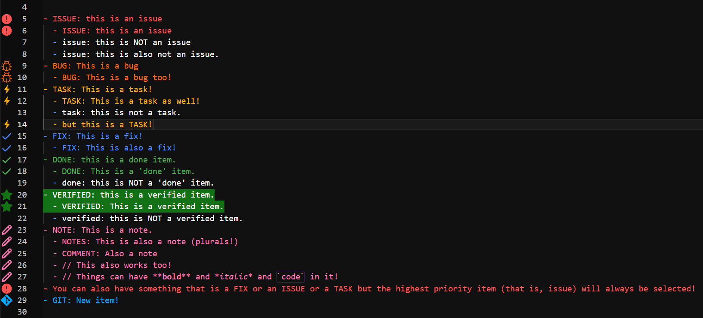
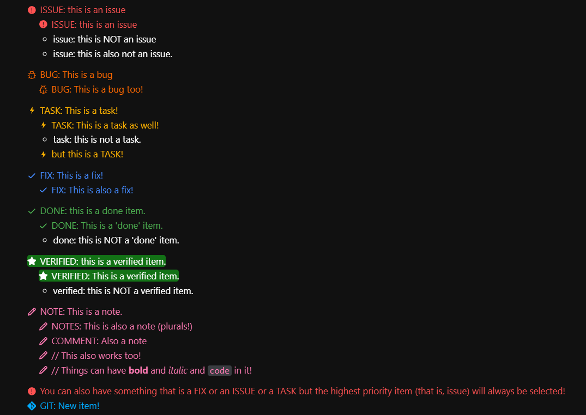
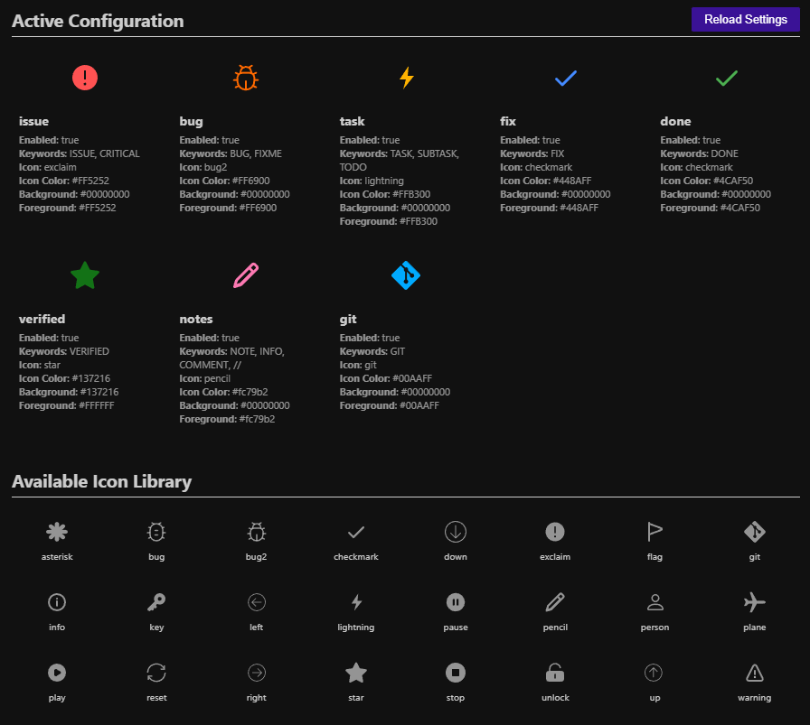

# Notes Markdown Highlighter

Visual Studio Code (VSCode) extension for Notes Markdown, a custom file type which can be used for daily notes.

[Marketplace Link](https://marketplace.visualstudio.com/items?itemName=jtpeller.nmd-highlighter)

## Overview

Notes Markdown is a concept which allows custom keywords to be specially highlighted. This is very useful for note-taking; whether it is for training, work, students, etc.

There are several features that are useful, including custom definitions (which have configurable colors!), symbol or date insertion, and more.

## Motivation

When I write daily notes, I was using OneNote, but found that it's not exactly portable, nor is it Git friendly like Markdown is.

I decided that it would be best to utilize Markdown, but I wanted to keep the same coloring I had previously used for each line.

This extension is a means of allowing that, plus some handy VSCode commands that automate some note-taking processes.

## Features

This VSCode extension features:

- Customizable keyword-based highlighting & formatting for a new file extension: `.nmd`
  - Applies these formats to VSCode's Markdown Preview, too!
- 24 icons to utilize for different categories of highlighting.
- A command to insert the timestamp and a keyword.
- A command to generate a Notes Markdown file for an entire month, useful for daily notes at work or school.
  - This command has many options, like the first day of the week, whether to include weekends, etc.
- A command to insert a right arrow, useful for process flow.
- A command to insert a colored definition template, useful for defining terminology or highlighting very important words.

## Formatting

The formatting is handled by a series of rules that are baked-in by default. These rules are shown in the table below.

| Category |       Color       |            Symbol             |        Keywords         | Description                                                |
| :------: | :---------------: | :---------------------------: | :---------------------: | :--------------------------------------------------------- |
|  Issue   |        red        | Exclamation point in a circle |     ISSUE, CRITICAL     | Critical or important things that need immediate attention |
|   Bug    |      orange       |              Bug              |       BUG, FIXME        | Something wrong with the code.                             |
|   Task   |       amber       |        Lightning Bolt         |   TASK, SUBTASK, TODO   | Something you need to do.                                  |
|   Fix    |       blue        |       Checkmark (blue)        |           FIX           | Issue or bug was fixed                                     |
|   Done   |       green       |       Checkmark (green)       |          DONE           | Marks that something was finished.                         |
| Verified | green (highlight) |             Star              |        VERIFIED         | Marks that something was tested as working as intended.    |
|  Notes   |    light pink     |            Pencil             | NOTE, INFO, COMMENT, // | Quick notes or not-so-critical things                      |

Here's a preview of the rules in the editor itself:



These rules also apply to the Markdown Preview! Take a look!



## Icons

You can see all of the icons using a command to pull up an Icon Gallery. Simply open VSCode's command palette (`Ctrl + Shift + P`), search for NMD Highlighter, and select: `Show Icon Gallery`.



## Commands

### Timestamp Inserter

You can insert a timestamp (via: `Ctrl + Shift + T`) which will input the timestamp and the keyword in the following format:

```markdown
[HH:MM] KEYWORD:
```

This allows quicker insertion of the keyword, and captures the date, if that's handy to you.

### Insert Rightarrow

You can insert a right arrow (via: Ctrl + K \`), which will insert a LaTeX right arrow, useful for processes.

```markdown
$\rightarrow$
```

### Insert Definition

You can insert a definition (via: `Ctrl + K Ctrl + D`), which will insert a LaTeX text-color definition.

```markdown
$\textcolor{#009f9f}{\textnormal{WORD}} \rightarrow$
```

This allows quick definitions.

### Monthly Note File Generator

Another command is the Monthly Note File Generator, which is useful if you take daily notes. It has multiple options that it will ask you for:

1. Which month and year you are targeting
2. Whether you want to include weekends
3. The first day of the week (***Do you fall for the Sunday-is-the-first-day-of-the-week propaganda? well, do ya?***)
4. Whether the days should be ascending or descending (should the last day of the month be at the top or the bottom?)

The format of the file is:

```markdown
# MM/YYYY

## Notes

### MM/DD

### MM/DD

// This pattern continues until every date in the month is included...
```

There are also separators between weeks to help navigate the file!
